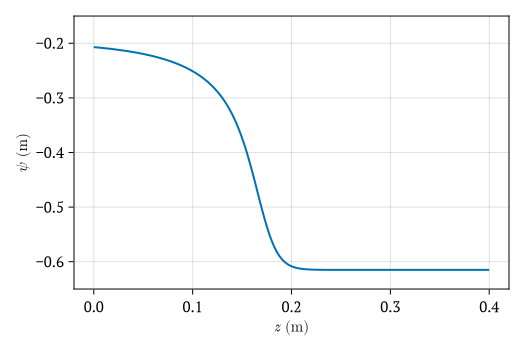
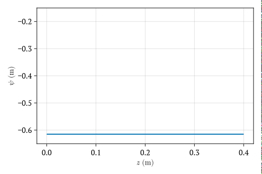
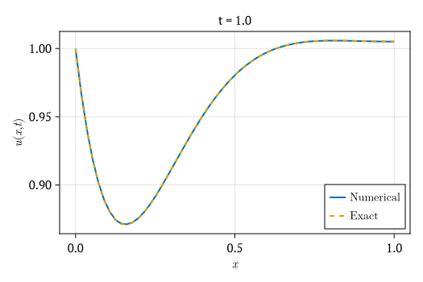
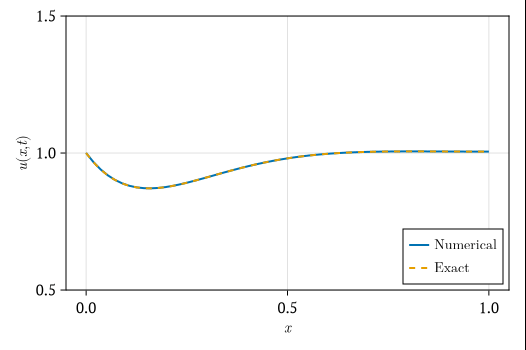
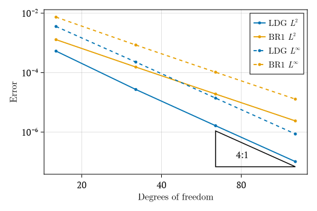

# HydroTrixi.jl

[](https://github.com/tristanmontoya/HydroTrixi.jl/actions/workflows/ci.yml)

**HydroTrixi.jl** is an adaptive discontinuous spectral-element solver for hydrologic problems. It builds upon the parabolic spatial discretization capabilities in
[Trixi.jl](https://github.com/trixi-framework/Trixi.jl) and the time integration methods in [SciML ecosystem](https://sciml.ai/), adding the following technical features to support the solution of the **Richards equation** in one spatial dimension:
- Mixed formulations that can advance different variables in time from those used in the spatial operator, with the constitutive relation imposed as a constraint as part of a differential algebraic equation
- Flexible parabolic boundary conditions allowing penalty-type numerical fluxes that depend on the inner and outer solution and flux values
- Tools to facilitate problem setup and visualization, with examples for standard hydrologic bencmark cases

## Installation

If you have not yet installed Julia, please [follow the instructions for your
operating system](https://julialang.org/downloads/platform/). HydroTrixi.jl works
with Julia v1.10 and newer. We recommend using the latest stable release.

Install and run HydroTrixi.jl from a local clone:

```bash
git clone https://github.com/uofs-simlab/HydroTrixi.jl.git
cd HydroTrixi.jl
julia --project=.
```

Then instantiate dependencies in the Julia REPL:

```julia
julia> using Pkg

julia> Pkg.instantiate()
```

Optional sanity check:

```julia
julia> Pkg.test()
```

Visualization is optional. Loading `CairoMakie` and `LaTeXStrings` activates
the plotting extension.

## Example usage

### Celia *et al.* (1990) infiltration benchmark

Run the provided "elixir" for Richards' equation in mixed form:

```julia
using HydroTrixi
using Trixi: trixi_include

elixir = joinpath(HydroTrixi.examples_dir(),
                  "elixir_richards_celia_1990.jl")
trixi_include(elixir;
              saveat = 0.0:2.0:360.0)
```

Plot the final time pressure head profile. Since there is no analytical
solution in this example, the plot contains only the numerical curve:

```julia
using CairoMakie
using LaTeXStrings

plot_solution_1d(sol;
                 component = 2,
                 xlabel = L"$z$ (m)",
                 ylabel = L"$\psi$ (m)",
                 size = (500, 350),
                 ylims = (-0.65, -0.15),
                 output_path = joinpath("plots",
                                        "richards_celia_1990_pressure_head.png"))
```



Generate an animation of the evolving pressure head profile:

```julia
animate_solution_1d(sol;
                    component = 2,
                    xlabel = L"$z$ (m)",
                    ylabel = L"$\psi$ (m)",
                    size = (500, 350),
                    ylims = (-0.65, -0.15),
                    output_path = joinpath("plots",
                                           "richards_celia_1990_pressure_head.gif"),
                    framerate = 30)
```



### Linear diffusion with mixed Dirichlet-Neumann boundary conditions

Run the simulation using `trixi_include`:

```julia
using HydroTrixi
using Trixi: trixi_include

elixir = joinpath(HydroTrixi.examples_dir(),
                  "elixir_diffusion_1d_mixed_dirichlet_neumann.jl")
tspan = (0.0, 1.0)
trixi_include(elixir;
              tspan = tspan,
              saveat = range(first(tspan), last(tspan); length = 121))
```

Plot the final-time solution profile at `t = 1.0` using the provided
visualization utilities based on `CairoMakie`:

```julia
using CairoMakie
using LaTeXStrings

plot_solution_1d(sol;
                 exact_solution = exact_solution,
                 size = (500, 350),
                 output_path = joinpath("plots",
                                        "diffusion_equation_1d_mixed_dirichlet_neumann_solution.png"))
```



Generate an animation from the same solution:
```julia
animate_solution_1d(sol;
                    exact_solution = exact_solution,
                    size = (500, 350),
                    output_path = joinpath("plots",
                                           "diffusion_equation_1d_mixed_dirichlet_neumann_solution_long.gif"),
                    ylims = (0.5, 1.5),
                    framerate = 30)
```



Run the BR1-vs-LDG convergence study:

```julia
include(joinpath(HydroTrixi.examples_dir(),
                 "convergence_diffusion_1d_mixed_dirichlet_neumann_br1_vs_ldg.jl"))
```

Generate the convergence plot from the computed study data:

```julia
include(joinpath(HydroTrixi.examples_dir(),
                 "plot_convergence_diffusion_1d_mixed_dirichlet_neumann_br1_vs_ldg.jl"))
```



## Acknowledgements
The developers of this package acknowledge funding support from the [Cooperative Institute for Research to Operations in Hydrology (CIROH)](https://ciroh.ua.edu/).
