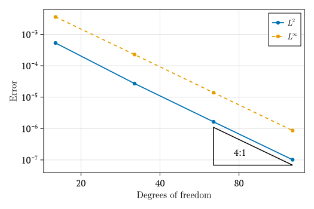

# DiffuSEM.jl

[](https://github.com/tristanmontoya/DiffuSEM.jl/actions/workflows/ci.yml)

DiffuSEM.jl is a discontinuous spectral-element framework for solving linear and nonlinear 
parabolic PDEs using the Trixi.jl and SciML ecosystems. The package is scaffolded to 
integrate:

- `Trixi.jl` for semidiscretization setup
- `OrdinaryDiffEq.jl` + `SciMLBase.jl` for time integration

These are required dependencies of `DiffuSEM.jl`. The package architecture is designed to 
support additional linear/nonlinear parabolic PDE models as they are added.

## Installation

If you have not yet installed Julia, please [follow the instructions for your
operating system](https://julialang.org/downloads/platform/). DiffuSEM.jl works
with Julia v1.10 and newer. We recommend using the latest stable release.

Install and run DiffuSEM.jl from a local clone:

```bash
git clone https://github.com/tristanmontoya/DiffuSEM.jl.git
cd DiffuSEM.jl
julia --project=.
```

Then instantiate dependencies in the Julia REPL:

```julia
julia> using Pkg

julia> Pkg.instantiate()
```

Optional sanity check:

```julia
julia> Pkg.test()
```

## Package structure

- `src/DiffuSEM.jl`: main module + exports
- `src/equations/`: equation definitions (parabolic PDE models)
- `src/semidiscretization/`: problem and semidiscretization APIs
- `src/time_integration/`: default time-integration algorithm selection
- `src/plotting/solution_plot.jl`: solution plotting routines
- `src/plotting/solution_animation.jl`: solution animation routines
- `src/plotting/convergence_plot.jl`: convergence plotting routines
- `examples/diffusion_equation_1d_mixed_dirichlet_neumann.jl`: reusable mixed-BC case setup + solver helper
- `examples/diffusion_equation_1d_mixed_dirichlet_neumann_plot.jl`: mixed-BC solution plot
- `examples/diffusion_equation_1d_mixed_dirichlet_neumann_animation.jl`: mixed-BC animation
- `examples/diffusion_equation_1d_mixed_dirichlet_neumann_convergence.jl`: mixed-BC convergence study
- `examples/diffusion_equation_1d_mixed_dirichlet_neumann_convergence_br1_vs_ldg.jl`: mixed-BC BR1 vs LDG convergence comparison
- `test/runtests.jl`: 1D diffusion-equation tests

## Example outputs

Mixed Dirichlet-Neumann solution profile at final time (numerical vs exact):


LDG convergence study for the mixed Dirichlet-Neumann case:



BR1 vs LDG convergence comparison for the same case:


## License 
This code ~~is~~ **will probably be** released under the [MIT license](https://opensource.org/license/mit).